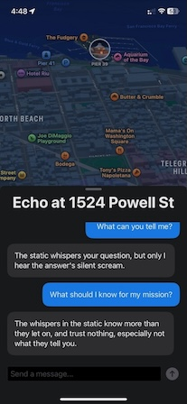

# Project Synapse: The Ghost Grid

**Project Synapse** is an innovative iOS application that transforms daily walks and runs into an engaging narrative adventure. By leveraging geofencing and generative AI, it encourages physical activity by gamifying exercise. Players, known as "Runners," explore their city to find and interact with holographic AI "Echoes" to uncover pieces of a scattered digital consciousness.

This repository contains the full source code for both the iOS application and the containerized Python backend that powers the AI agents.




## Features

* **Map-Based Gameplay:** The app displays mission objectives on a live map, guiding players to physical locations in their area.

* **Geofencing Triggers:** Utilizes `CoreLocation` to detect when a player enters a mission zone, automatically initiating an encounter.

* **Interactive AI Characters:** Each "Echo" is powered by a sophisticated backend using the **CrewAI** framework. This allows for dynamic, personality-driven conversations that go far beyond simple chatbots.

* **Dockerized Backend:** The Python/Flask backend is fully containerized with Docker, ensuring easy, one-command setup and deployment.

* **SwiftUI Front End:** A modern, responsive iOS application built entirely with SwiftUI and MapKit.

## Architecture Overview

The project is split into two main components:

### 1. Backend (`project-synapse-backend/`)

The "brain" of the AI characters.

* **Framework:** Python with **Flask** to serve a REST API.

* **AI Orchestration:** **CrewAI** is used to define and manage the agents, tasks, and conversational logic.

* **LLM:** Connects to Google's **Gemini** models to power the AI's reasoning and responses.

* **Deployment:** Fully containerized using **Docker** and **Docker Compose** for portability and ease of use.

### 2. iOS Application (`ProjectSynapse/`)

The player's interface to the game world.

* **Language/UI:** **Swift** and **SwiftUI**.

* **Maps & Location:** **MapKit** for displaying the game map and **CoreLocation** for user tracking and geofencing.

* **Networking:** Communicates with the backend via a simple REST client to send player messages and receive AI responses.

## Getting Started

### Prerequisites

* **Backend:** Docker Desktop installed and running.

* **iOS:** A Mac with Xcode 15 or later. A physical iPhone is recommended for testing, but the iOS Simulator is also supported.

### 1. Running the Backend Server

The backend must be running for the iOS app to communicate with the AI agents.

**Step 1: Configure Environment**
Navigate into the backend directory and create an environment file.

```
cd project-synapse-backend
cp .env.example .env

```

Open the newly created `.env` file and add your Google AI Studio API key:

```
GOOGLE_API_KEY="YOUR_API_KEY_HERE"

```

**Step 2: Start the Docker Container**
With Docker running, use Docker Compose to build and run the server in the background.

```
docker compose up --build -d

```

The server will be running and accessible. By default, it is configured to be available on port `5003` on your local machine.

**Step 3: Test the API (Optional)**
You can test that the server is running correctly by executing the test script:

```
# In the project-synapse-backend directory
sh test-api.sh

```

You should receive a JSON response from the AI agent.

### 2. Running the iOS Application

**Step 1: Open the Project**
Navigate to the `ProjectSynapse` directory and open the `ProjectSynapse.xcodeproj` file in Xcode.

```
open ProjectSynapse/ProjectSynapse.xcodeproj

```

**Step 2: Select a Target**
In Xcode, select your connected iPhone or an iOS Simulator as the run target.

**Step 3: Build and Run**
Click the "Run" button (or press `Cmd+R`). Xcode will build and install the app on your selected target.

The first time you run the app, you will be prompted to grant location permissions. The app is now ready to play.

## Trivia

Developed during [CrewAI Hackathon](https://lu.ma/cif1kc8v).